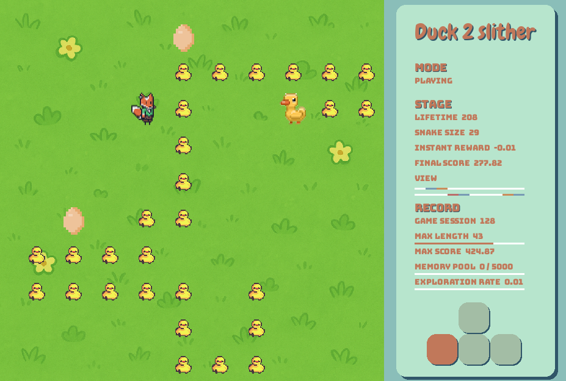
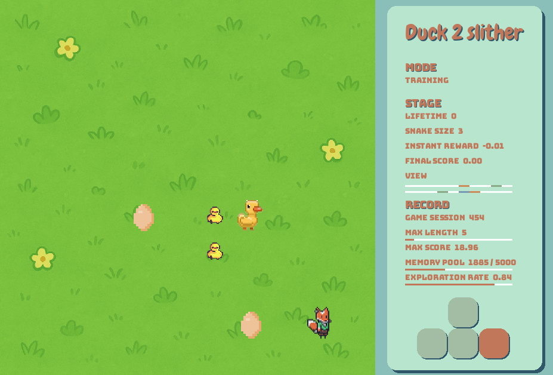
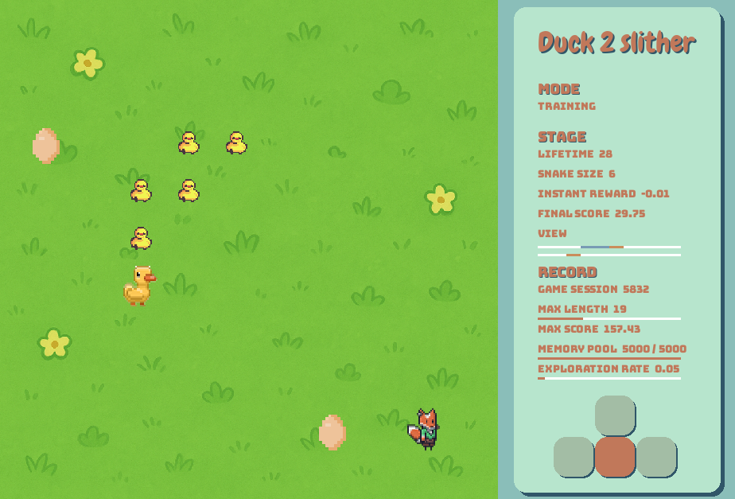

# Learn2Slither

A **reinforcement learning** project that trains an AI agent to play the classic **Snake** game using a **Deep Q-Network (DQN)** implemented from **scratch**.


## Overview

**Learn2Slither** uses a Deep Q-Network built on a custom **multilayer perceptron (MLP)** — without relying on any deep learning frameworks.

Repo: [[multilayer perceptron]](https://github.com/swangarch/multilayer_perceptron)

The agent learns to maximize its snake length through reinforcement learning, improving its policy via experience replay and Q-learning updates. After training for 100,000 sessions, the snake reached a **maximum** length of **50**, with an **average** length of **25**, demonstrating clear learning progress.



## Features

- Custom-built 10×10 Snake environment.
- **User-friendly interface** with real-time visualization of key parameters, training metrics, and game state for intuitive monitoring of the learning process.
- Implementation of a **Deep Q-Network (DQN)**  
- **Neural network (MLP)** built from scratch only using **NumPy**  
- **Replay memory** and epsilon-greedy exploration  
- Visualization of training progress and gameplay
- Differents training strategies for comparasion
- **Modular** and **decoupled** architecture: The **DQN**, **game environment**, and **neural network model** are fully decoupled.
- A unified **IGame interface** is introduced — any game implementing this interface can be trained directly using the same DQN class, enabling easy extension to new environments.

## Dependencies

- Python  
- NumPy  
- Matplotlib
- Pygame

## Getting Started

### Setup

```bash
git clone https://github.com/swangarch/learn2slither.git
cd learn2slither

make setup
source venv/bin/activate # to setup virtual enviroment
```
### Train and play

```bash
make train-show 
# train with visualization

make train-load 
# train with visualization and pre-trained weights

make train-off 
# train without visualization

make train-off-load 
# train without visualization but with pre-trained weights

make play 
# evaluate the trained model (no random moves, no weights update, loads pre-trained weights)

```
During training with visualization, press Q to slow down the progress for observation, and E to resume.

## Game enviroment

The Snake game is played on a **10×10** grid, starting with 3 body segments, and **two green apples** and **one red apple** are randomly placed on the grid. When one apple is eaten, a new one is generated. Green apple will increase snake length by 1 where red apple will decrease snake length by 1. Snake will be dead if it hits wall or has self collision or length reach 0.

**Special Constraint**: To add some challenge, The snake’s vision is limited to the same row and column as its head. It cannot see or detect anything outside of that line of sight — all other cells remain completely unknown. 

Two different environment representations are tesed in the DQN to compare performance:

- #### Input: Vector of coordinates
    Includes snake head, body parts, and food positions. Compact and efficient for small maps.

    Example:

    ```[c1.x1, c1.x2, c1.x1, c1.x2, s1.x1, s1.x2, s2.x1, s2.x2, s3.x1, s3.x2 ... ]```

    (28 dimensions total)
    
    Here, c1 and c2 represent the collectibles (apples), s1 is the head, and the remaining s values represent the body.
    If the snake length is less than 12, -1 padding is used.

    After training on 20,000 game sessions, the maximum achieved length is 22, with an average around 15–18.


- #### Input: Row and column encoding
    Example:

    ```[0, 0, C, 0, 0, 0, H, 0, 0, 0] + [0, 0, C, 0, H, S, S, 0, 0, 0]```

    (20 dimensions total)

    After training on 5,000 game sessions, the maximum achieved length is 33 (without red apple).

    After training on 50,000 game sessions, the maximum achieved length is 45 (without red apple).

    After training on 100,000 game sessions, the maximum achieved length is 47, with an average around 22–27 (with red apple).

Because the row and column encoding shows significantly better performance, it is used as the default representation in this project.


## Methodology

### Q-Learning?

The **Q** in Q-Learning refers to **Quality** - it measures the quality (expected future reward) of taking a particular action in a given state.

The core idea is to maintain a Q-table that maps each possible state to the expected reward for each action:

| State \ Action | up  | down | left | right |
|---------------|-----|------|------|-------|
| state1        | 5.0 | 3.0  | 1.0  | -1.0  |
| state2        | 3.2 | 4.5  | 2.1  | 0.5   |
| state3        | 1.5 | 2.0  | 4.0  | 3.0   |
| state4        | -1.0| 0.5  | 3.5  | 5.0   |
| state5        | 2.0 | 1.5  | 0.5  | 3.5   |
| ...           | ... | ...  | ...  | ...   |

### The Q-Learning Formula

The Q-value is updated using the Bellman equation:
```
Q[s, a] = reward + γ · max(Q[s', a'])
```

Where:
- `s` = current state
- `a` = action taken
- `reward` = immediate reward received from environment
- `γ` (gamma) = discount factor (how much we value future rewards)
- `s'` = next state after taking action
- `max(Q[s', a'])` = maximum Q-value for all possible actions in the next state, we assume the model will always take the best action in the future

This is like a recursive function - the quality of current action depends on the quality of future actions. Ideally, with a perfect Q-table, the snake would always know which move maximizes future reward expectation.


### Reward

The reward is the feedback from the environment that guides learning:

| Event | Reward | Purpose |
|-------|--------|---------|
| Eat green apple  | +10.0 | Encourage collecting good food |
| Eat red apple | -0.1 | Discourage collecting bad food |
| Each step (lazy penalty) | -0.01 | Motivate efficiency, prevent wandering |
| Death  | -1.0 | Strongly discourage self-collision or hitting walls, or reach 0 length |

The snake learns to maximize cumulative reward by eating green apples quickly while avoiding red apples and staying alive.

### Training process

At the beginning, we have no idea what Q-values should be for each state. The solution:
1. **Initialize all Q-values to zero**
2. **Update gradually through exploration** - start from random movements, record the states and movements, as the snake plays, it discovers which actions lead to good outcomes
3. **Learn from experience** - each game teaches the model which moves are beneficial

### Why Neural Networks?

As state space has too many possible cases, storing a complete Q-table becomes impractical. For example, with a 20-dimensional continuous state vector, we'd need infinite memory.

**Solution: Deep Q-Network (DQN)**

Instead of storing a table, we train a neural network to **approximate** the Q-function. The network learns to predict Q-values for any state it encounters.

### Network Architecture

In this project, Deep Q-Network use a 5-layer Multi-Layer Perceptron (MLP):

- **Shape**: `[20, 128, 64, 16, 4]`
- **Activation Functions**: `["leaky_relu", "leaky_relu", "leaky_relu", "none"]`
- **Loss Function**: `MeanSquareError`

### Training Process

1. **Experience Collection**: Snake plays and stores (state, action, reward, next_state)
2. **Q-Value Prediction**: Network predicts Q-values for current state
3. **Target Calculation**: Compute target using Q-Learning Formula
4. **Network Update**: Minimize MSE between predicted and target Q-values
5. **Repeat**: Network gradually learns which actions lead to better outcomes

This approach allows the snake to learn optimal behavior through trial and error, without needing to explore every possible state.

At the beginning of training, the snake moves almost completely at random.
It occasionally reaches the apple by chance, but most of the time it dies quickly, and its maximum length rarely exceeds 5.



As training continues, we can clearly observe that the snake’s maximum length increases, showing that the model is gradually learning how to survive longer and collect more apples.



## Learning Optimization Strategies
- Use a replay memory pool of size 5000 to store states and Q-value targets.
Each step samples a batch of 64 experiences for training.
- Start with random actions, gradually decreasing epsilon to let model predictions take over, while retaining a small amount of exploration.
- Since eating an green apple is a low-probability event, successful experiences are duplicated and rewards are increased to balance the dataset, and eat green apple will have bigger reward value.
